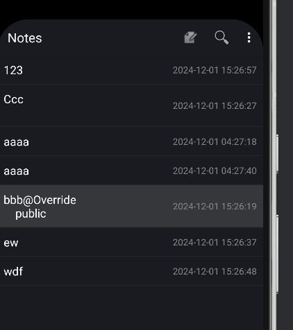
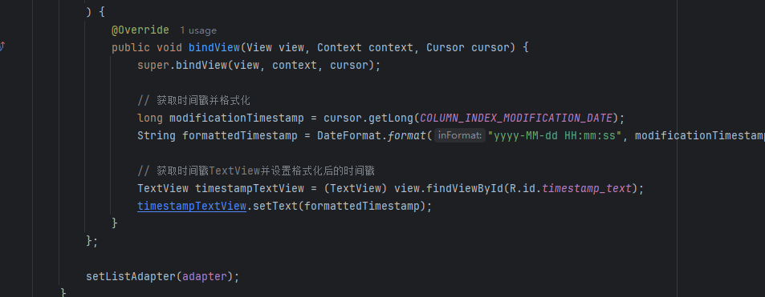
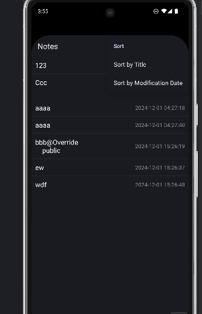
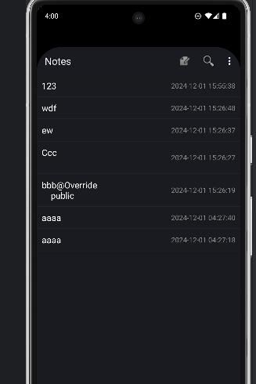
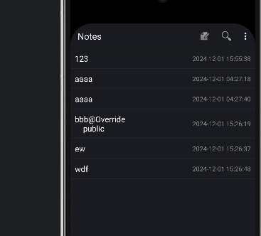
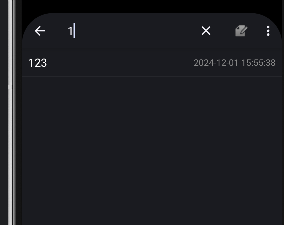
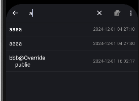
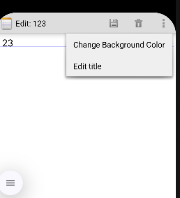
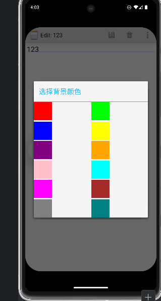
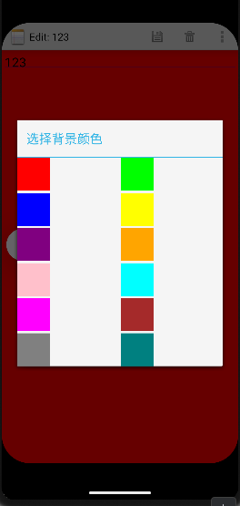

# Android记事本应用

这是一个基于Android的记事本应用，允许用户创建、编辑和管理笔记。该应用使用NoSQL数据库存储数据，为用户生成的内容提供灵活、可扩展的存储解决方案。

## 功能

### 1. **NoteList界面显示时间戳**
   - **功能描述**：NoteList界面现在为每个笔记条目显示时间戳。
   - **实现方式**：当笔记被创建或修改时，应用会自动生成并存储时间戳。这个时间戳会在主界面的笔记列表中显示。
 #### 截图展示：
   
 #### 代码实现：
  
  ### 2. **排序功能**
   - **功能描述**：笔记现在可以按时间（时间顺序）或标题（字母顺序）进行排序。
   - **实现方式**：用户可以在NoteList界面中的菜单中选择排序方式，笔记会根据选定的方式重新排列，按创建或修改时间排序，或按标题字母排序。
 #### 截图展示：
   
      
        
        #### 代码实现：
### 3. **笔记查询功能**
   - **功能描述**：新增了按标题或内容搜索笔记的功能。
   - **实现方式**：用户可以在搜索框中输入关键字，应用会根据标题或内容与搜索词匹配的笔记进行筛选，方便用户快速找到特定笔记。
   
     
### 4. **更改记事本背景**
   - **功能描述**：用户现在可以更改记事本界面的背景。
   - **实现方式**：在设置或选项菜单中，用户可以选择不同的背景主题或图片，使记事本界面更加个性化。
 #### 截图展示：
   
      
         
            

